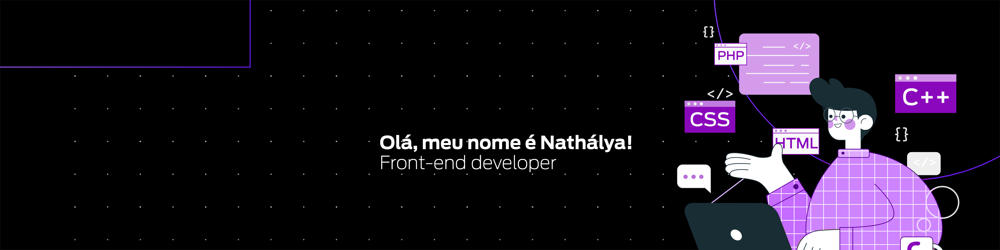

 

## Hi, there 👋🏻

- 👩🏻‍💻 My name's Nathálya, I'm a Frontend Developer from Rio de Janeiro, Brazil.

- 📚 I'm currently learning ReactJS and improving my knowledge of the basic FE stack.

- 🕹 I like technology in general. I can spend hours watching videos and reading about new tech stuff, setting up my Neovim environment, listening to music and reading a good book.

 

 

## Stack

 

## Tools

 

## Contact

 

## Stats

  

  
  

